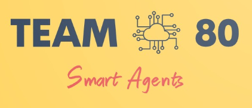

# Welcome to Team80 DS4A 2020 Repository



This is the final proyect repository


Information provided by Omnivida is distributed in 17 datafiles. A star-schema was implemented, around “Datos Basicos” , the demographical data.


A quick overview of the content of this repository is presented below

    


## 1. 0_eda 
    The EDAs per file are located in this folder.


## 2. 1_data_transformation
    In this folder is:
    - Final cleaning of data used in the Front End
    - The modules of the construction of variables for the model.

### 2.1 0_borradores
    EDA depuration and preliminar feature construction.

### 2.2 1_consolidacion_mensual 
    .py cleanining and monthly consolidation features per file.

### 2.3 ETL_To_Excel_and_SQL
    - Notebooks with final cleaning to demographic data for Front End
    - SQL templates to make a database

###  2.4 consolidacion.ipynb / generic_funcions.py ...   
    Make model database (generic_function)    

##  3. model 
    Some preliminary results for traditional classification models

### 3.1 proyect.ipynb
    Notebook with final model code and implementation.

###  ```3.2 consolidado.py ```
    Data Engineering heart 
    Make all the process using modular infrastructure, since data cleaning to model report.

## 4. eda_adherencia
    Preliminary analysis of specific features and adherence
##  5. R_scripts/src
    All code for shinyapps Front End

